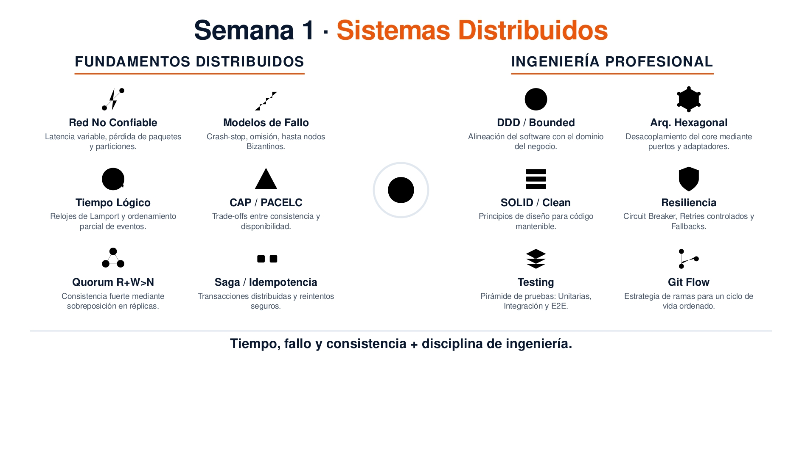

<<<<<<< HEAD
<!-- HU-STATUS TEMPLATE - do NOT remove the <!-- ... --> markers or the table headers.
     Your weekly grade is read AUTOMATICALLY from this file:
       01-week/hu-status/README.md  (inside YOUR fork). English. -->

# Weekly Status - Week 01

<!-- CONFIG-START - must match your profile repo (username/username) CONFIG -->
- FULL_NAME: JUAN PABLO BORRERO MORALES
- GITHUB_USER: JUANDAX233
- TEAM: BarberSaaS
- SPRINT_GOAL: DEFINE THE ENTIRE PDR
<!-- CONFIG-END -->

## 1. User stories worked this week
| HU ID | Title | Status (todo/doing/done) | Evidence (PR or commit URL) |
|---|---|---|---|
| HU-XXX-001 | NONE | NONE | NONE |

## 2. My individual contribution
-I collaborated in creating the project idea and the requirements that the PDR will entail.
-I MADE THE SUMMARY FOR WEEK 1

## 3. Blockers and risks
-THERE IS INFORMATION IN THE PDR THAT IS MISSING DUE TO LACK OF CUSTOMER INFORMATION

## 4. Plan for next week
-I WILL DO THE SUMMARY FOR WEEK 2

## 5. Compliance self-check
- [ ] Conventional Commits - `type(scope): summary`
- [ ] Per-environment HU branch + PR to that environment (hu-xxx-dev -> develop, ...)
- [X] Testable acceptance criteria
- [ ] Tests added/updated (unit / integration)
- [ ] DDD / hexagonal boundaries respected (domain has no I/O)
- [ ] No secrets; config via environment variables

## 6. Evidence links
[Ver PDR - BarberSaaS](PDR-BarberSaaS.md)
-

## This week
The core problem that BarberSaaS architecture solves (designed as a modular monolith ready to evolve into microservices) is the operational fragmentation and lack of real-time integrity experienced by independent barbershops in Colombia. Specifically: Critical containment of shared resources (the simultaneous booking problem): Multiple clients or receptionists may attempt to book the same time slot with the same barber at the exact same time, which in a system without strict control would lead to double-booking. Non-blocking asynchronous synchronization (notifications and loyalty): Ensuring that the user experience is not degraded when external services fail (such as the FCM notification gateway or SMTP email delivery), by decoupling critical transactional events from messaging tasks. Strict multi-tenant consistency: Ensuring absolute data isolation for each barbershop (barbershop_id) without compromising the read performance of analytical dashboards and barber-specific reports. To-do list (MVP 1) — Operations P

