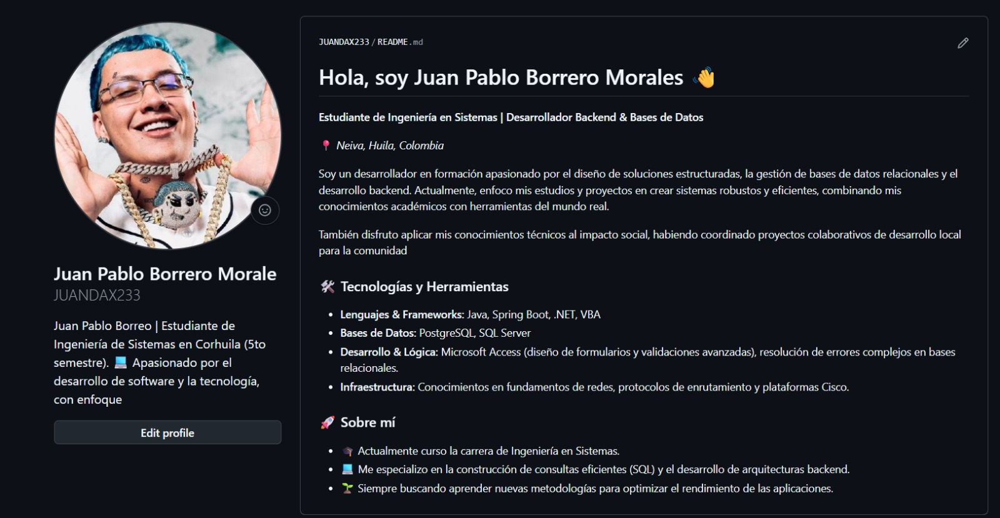
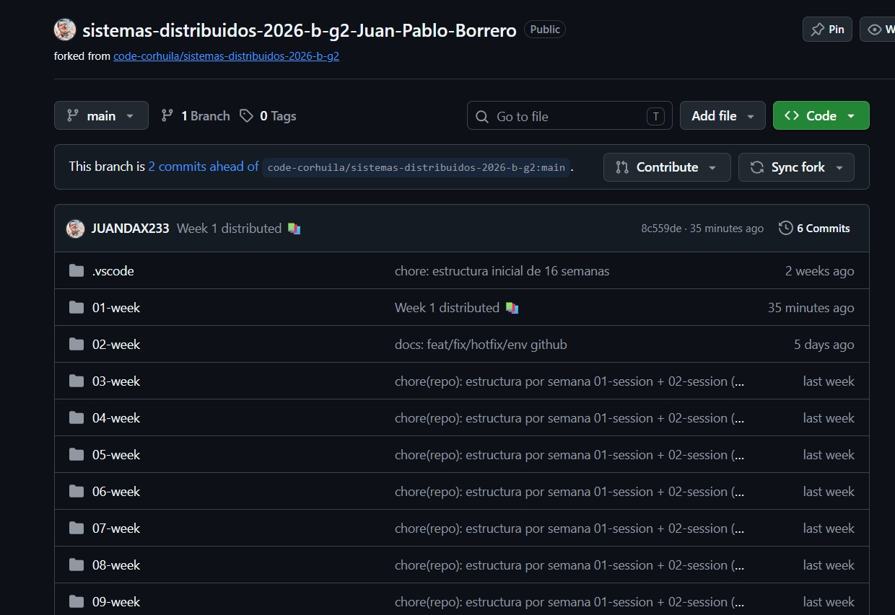
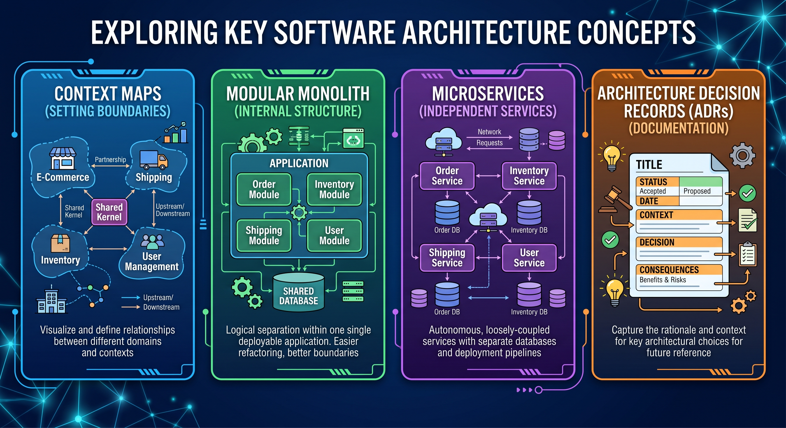
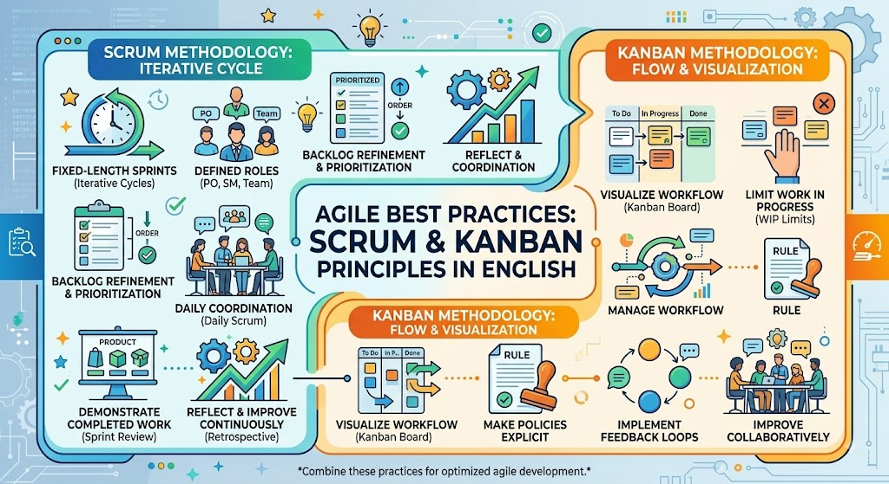

<!-- HU-STATUS TEMPLATE - do NOT remove the <!-- ... --> markers or the table headers.
     Your weekly grade is read AUTOMATICALLY from this file:
       02-week/hu-status/README.md  (inside YOUR fork). English. -->

# Weekly Status - Week 02

<!-- CONFIG-START - must match your profile repo (username/username) CONFIG -->
- FULL_NAME: JUAN PABLO BORRERO MORALES
- GITHUB_USER: JUANDAX233
- TEAM: BarberSaaS
- SPRINT_GOAL: Best Practices Manual: Agile Methodologies (Scrum/Kanban) and Repository Management
<!-- CONFIG-END -->

## 1. User stories worked this week
| HU ID | Title | Status (todo/doing/done) | Evidence (PR or commit URL) |
|---|---|---|---|
| HU-XXX-001 | NONE | NONE | NONE |

## 2. My individual contribution
-We learned good scrum and canva practices
-Create my weekly repository and my personal presentation repository
-Created my weekly repository using Conventional Commits
-I prepared a weekly summary of each session (ADR and Distributed architectures)

## 3. Blockers and risks
-Learning the differences between scrum and canva

## 4. Plan for next week
-Apply the best practices of Scrum and Canva in my next project

## 5. Compliance self-check
- [X] Conventional Commits - `type(scope): summary`
- [ ] Per-environment HU branch + PR to that environment (hu-xxx-dev -> develop, ...)
- [ ] Testable acceptance criteria
- [ ] Tests added/updated (unit / integration)
- [ ] DDD / hexagonal boundaries respected (domain has no I/O)
- [ ] No secrets; config via environment variables

## 6. Evidence links
-

-https://github.com/JUANDAX233/sistemas-distribuidos-2026-b-g2-Juan-Pablo-Borrero.git

