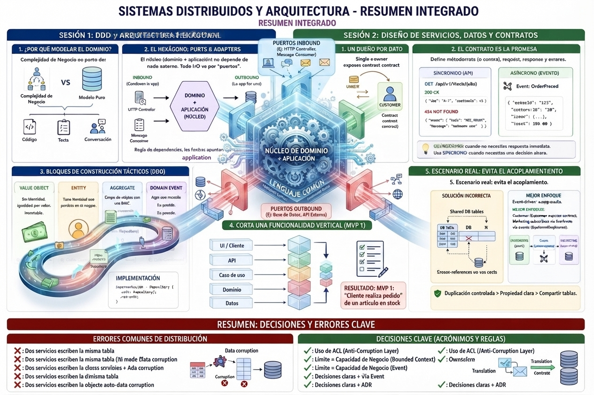

<!-- HU-STATUS TEMPLATE - do NOT remove the <!-- ... --> markers or the table headers.
     Your weekly grade is read AUTOMATICALLY from this file:
       03-week/hu-status/README.md  (inside YOUR fork). English. -->

# Weekly Status - Week 03

<!-- CONFIG-START - must match your profile repo (username/username) CONFIG -->
- FULL_NAME: JUAN PABLO BORRERO MORALES
- GITHUB_USER: JUANDAX233
- TEAM: BarberSaaS
- SPRINT_GOAL: Consolidate the BarberSaaS multi-tenant PDR baseline, define agile team conventions, and align the modular monolith architecture for Phase 1.
<!-- CONFIG-END -->

## 1. User stories worked this week
| HU ID | Title | Status (todo/doing/done) | Evidence (PR or commit URL) |
|---|---|---|---|
| DOC-01 | Formalize the BarberSaaS multi-tenant PDR v2.0 baseline | done | [Data/PDR-BarberSaaS.md](./Data/PDR-BarberSaaS.md) |

## 2. My individual contribution
- I consolidated the comprehensive Product Requirements Document (PRD v2.0) for BarberSaaS, detailing the multi-tenant architecture, roles (SUPER_ADMIN, ADMIN_BARBERSHOP, BARBER, CLIENT), and features.
- I structured the agile team conventions aligned with our team members, sprint cadence, 2-week iteration cycles, story point estimation rules, and GitHub Projects workflow.
- I detailed the bounded contexts for the modular monolith backend (Spring Boot 3 / Java 21) and the mobile frontend (React Native + Expo SDK 54).
- I established tenant isolation safeguards via `TenantContext` ThreadLocal and pessimistic database locks (`PESSIMISTIC_WRITE`) to guarantee zero double-bookings.
- I aligned the project narrative around the Colombian barbershop market, covering COP currency formatting, Spanish localization, walk-in client tracking, and loyalty coupon mechanics.
- Weekly summary of the evaluation period and corresponding Moodle challenge submissions.

## 3. Blockers and risks
- Migration from development MySQL to production PostgreSQL is pending before the Phase 2 railway deployment.
- Managing Firebase Cloud Messaging (FCM) delivery robustness under intermittent mobile network conditions.
- Ensuring trial expiration tracking and automated notifications handle edge cases smoothly.

## 4. Plan for next week
- Finalize the remaining Phase 1 components, including walk-in client tracking and trial expiration automation.
- Prepare the production environment configuration for railway deployment and database migration.
- Review sprint backlog items for Phase 2 controlled launch preparation.

## 5. Compliance self-check
- [x] Conventional Commits - `type(scope): summary`
- [x] Testable acceptance criteria
- [x] DDD / modular monolith boundaries respected (bounded contexts separated by package structure)

## 6. Evidence links
[Ver PDR - BarberSaaS](PDR-BarberSaaS.md)

