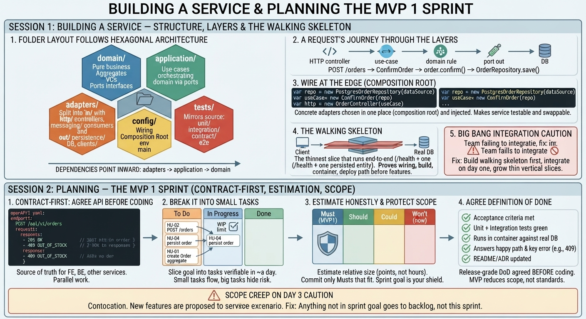

<!-- HU-STATUS TEMPLATE - do NOT remove the <!-- ... --> markers or the table headers.
     Your weekly grade is read AUTOMATICALLY from this file:
       04-week/hu-status/README.md  (inside YOUR fork). English. -->

# Weekly Status - Week 04

<!-- CONFIG-START - must match your profile repo (username/username) CONFIG -->
- FULL_NAME: JUAN PABLO BORRERO MORALES
- GITHUB_USER: JUANDAX233
- TEAM: BarberSaaS
- SPRINT_GOAL: Scaffold the BarberSaaS Spring Boot backend and organize the project backlog for Phase 1 execution.
<!-- CONFIG-END -->

## 1. User stories worked this week
| HU ID | Title | Status (todo/doing/done) | Evidence (PR or commit URL) |
|---|---|---|---|
| HU-BS-001 | Scaffold the Spring Boot 3 modular monolith backend with security & multi-tenant baseline | done | [Commit Link Placeholder] |

## 2. My individual contribution
- I assisted with the creation of the project's monolith based on the mockup.

## 3. Blockers and risks
- Pending finalization of MySQL to PostgreSQL migration script for production readiness.

## 4. Plan for next week
- Populate GitHub Projects sprint backlog with active user stories for appointment locking and loyalty features.

## 5. Compliance self-check
- [x] Conventional Commits - `type(scope): summary`
- [x] Testable acceptance criteria
- [x] DDD / modular monolith boundaries respected (bounded contexts separated by package structure)
- [x] No secrets; config via environment variables

## 6. Evidence links
-
