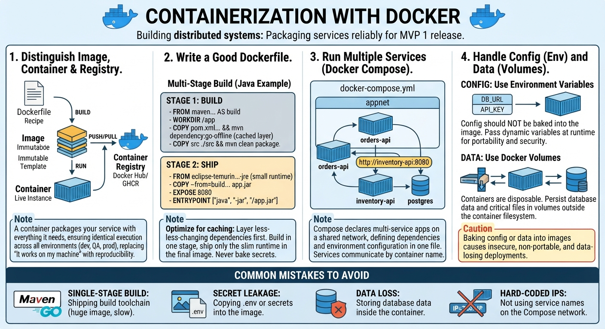

<!-- HU-STATUS TEMPLATE - do NOT remove the <!-- ... --> markers or the table headers.
     Your weekly grade is read AUTOMATICALLY from this file:
       05-week/hu-status/README.md  (inside YOUR fork). English. -->

# Weekly Status - Week 05

<!-- CONFIG-START - must match your profile repo (username/username) CONFIG -->
- FULL_NAME: Juan pablo Borrero morales
- GITHUB_USER: JUANDAX233
- TEAM: BarberSaaS
- SPRINT_GOAL: Ship MVP1: Deploy modular backend and database infrastructure to Railway, configure PostgreSQL persistence and concurrency policies (PESSIMISTIC_WRITE), and finalize DevOps automation and backups.
<!-- CONFIG-END -->

## 1. User stories worked this week
| HU ID | Title | Status (todo/doing/done) | Evidence (PR or commit URL) |
|---|---|---|---|
| DEV-01 | Configure Railway infrastructure, environment variables, and automated daily backups with 30-day retention | done | Railway Project Dashboard & Deployment Config |
| DB-01 | Implement PostgreSQL 16 migration script and data seeding for MVP1 multi-tenant architecture | done | Database Schema & Migration Scripts |
| CONC-01 | Implement and stress-test pessimistic write locks (`PESSIMISTIC_WRITE`) for appointment booking concurrency | done | PDR & Backend Concurrency Validation |
| NOTIF-01 | Integrate asynchronous push notifications (FCM) and email alerts without blocking critical transactions | done | Service & Notification Module Implementation |

## 2. My individual contribution
- Configured and managed the deployment infrastructure on Railway, ensuring secure environment variable handling (such as `JWT_SECRET`) and setting up automated daily database backups with a 30-day retention policy.
- Designed and verified the PostgreSQL persistence layer and migration strategy, ensuring robust multi-tenant data isolation per barbershop (`barbershop_id`).
- Implemented and stress-tested concurrency controls using database-level pessimistic write locks (`PESSIMISTIC_WRITE`) during appointment creation to guarantee 0% double-booking under high load.
- Structured and documented the distributed system design, operational delivery semantics, and task backlog in the project PDR.

## 3. Blockers and risks
- Transitioning production workloads from development settings to PostgreSQL 16 required careful validation of transaction isolation levels to prevent deadlocks during concurrent slot bookings.
- Ensuring that asynchronous FCM push dispatches and SMTP recovery emails fail gracefully without impacting the ACID consistency of core appointment bookings.

## 4. Plan for next week
- Monitor production performance and query execution plans on Railway following the initial Private Beta deployment.
- Fine-tune automated backup restoration drills and review system health-check telemetry.
- Support the engineering team in scaling notification dispatch workers for Phase 2 rollout.

## 5. Compliance self-check
- [x] Conventional Commits & structured task management
- [x] Strict multi-tenant data isolation (`barbershop_id`)
- [x] ACID compliance for critical transactional operations (Appointments, Loyalty, Finance)
- [x] No secrets; secure configuration via environment variables on Railway

## 6. Evidence links
--
