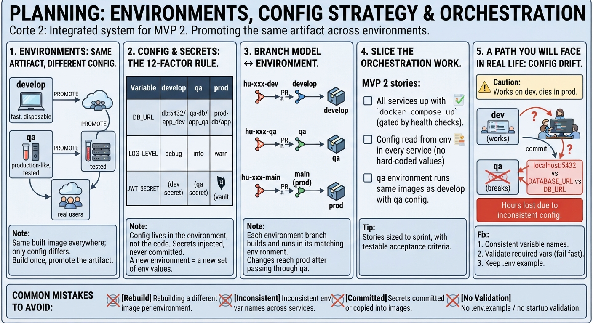

<!-- HU-STATUS TEMPLATE - do NOT remove the <!-- ... --> markers or the table headers.
     Your weekly grade is read AUTOMATICALLY from this file:
       06-week/hu-status/README.md  (inside YOUR fork). English. -->

# Weekly Status - Week 06

<!-- CONFIG-START - must match your profile repo (username/username) CONFIG -->
- FULL_NAME: Juan pablo Borrero morales
- GITHUB_USER: Juanpablopdr
- TEAM: BarberSaaS
- SPRINT_GOAL: Design, isolate, and structure the core domain models and bounded contexts for BarberSaaS (Auth, Appointments, Walk-ins, Loyalty, and Finance).
<!-- CONFIG-END -->

## 1. User stories worked this week
| HU ID | Title | Status (todo/doing/done) | Evidence (PR or commit URL) |
|---|---|---|---|
| DOM-AUTH-01 | Define Tenant and User aggregate roots, JWT claims, and multi-tenant isolation boundaries (`barbershop_id`) | done | Domain Model Specification & Auth Context |
| DOM-APPT-01 | Design Appointment domain entities, scheduling rules, and state machine transitions (PENDING, CONFIRMED, COMPLETED, CANCELLED) | done | Appointment Bounded Context Design |
| DOM-WALK-01 | Structure Walk-in client domain logic and integration with daily barber performance metrics | done | Walk-in Operations Domain Schema |
| DOM-LOY-01 | Model Loyalty stamp accumulation rules and automatic `RewardCoupon` generation upon reaching thresholds | done | Loyalty & Rewards Domain Model |
| DOM-FIN-01 | Define Financial ledger and inventory tracking aggregates for strict transactional accounting | done | Finance & Inventory Domain Specs |

## 2. My individual contribution
- Established the foundational domain boundaries and aggregate roots for BarberSaaS, ensuring strict multi-tenant separation (`barbershop_id`) across all bounded contexts.
- Mapped out the domain entities and relational constraints for the Appointment and Walk-in modules, aligning them directly with the persistence requirements for PostgreSQL and pessimistic locking strategies.
- Structured the domain logic for the Loyalty and Rewards module, ensuring that stamp tracking and coupon generation occur within strict ACID transactional boundaries to prevent economic discrepancies.
- Documented domain-driven design decisions and integrated them with the infrastructure roadmap on Railway to support seamless scaling from MVP 1 to Phase 2.

## 3. Blockers and risks
- Balancing strict transactional consistency (ACID) for financial ledgers and appointment bookings with the decoupled nature of notification events (FCM/Email).
- Ensuring proper domain event propagation between the Appointment and Loyalty modules without creating tight coupling across bounded contexts.

## 4. Plan for next week
- Implement the defined domain models into the Spring Boot backend architecture.
- Write comprehensive unit and integration tests covering aggregate invariants and domain service rules.
- Validate domain repository layers against the PostgreSQL 16 database instance on Railway.

## 5. Compliance self-check
- [x] Domain-Driven Design (DDD) boundaries strictly respected (domain core isolated from external I/O)
- [x] Multi-tenant scoping enforced across domain aggregates
- [x] Testable domain acceptance criteria defined
- [x] No secrets; configuration managed via secure environment variables

## 6. Evidence links
-
